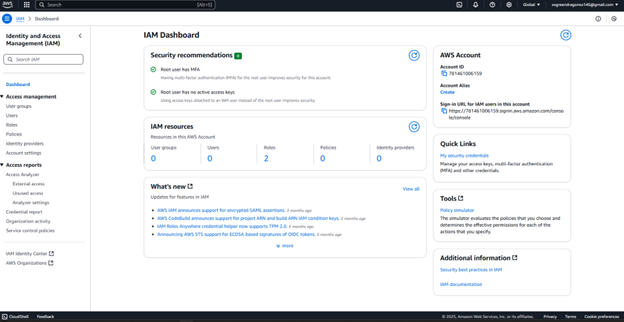

# Setting Up a Cloud Server

**Name:** Thien Nguyen  
**Date:** 4/30/2025  

---

## 📖 Introduction
In this lab, I created a virtual machine (VM) in the cloud and connected to it using SSH.  
This process helps us understand how cloud services work and prepares us to set up a honeypot in the next lab.  

---

## 🛠 Breakpoints

### 🔹 Breakpoint 1 – Creating an AWS Account
- I registered for a **free Amazon Web Services (AWS) account** using my personal email.  
- I selected the **AWS Free Tier**, which provides limited resources like EC2 instances, S3 storage, and IAM access at no cost for one year.  
- This step ensured I had the necessary access to cloud services for the lab without financial risk.  

---

### 🔹 Breakpoint 2 – Securing the Root Account
- I protected the AWS **root account** by setting up **Multi-Factor Authentication (MFA)** using the Duo Mobile app.  
- After linking the QR code with my account, every login required approval on my phone, adding strong protection against unauthorized access.  
- I also configured **Free Tier usage alerts** in the AWS Billing Console.  

---

### 🔹 Breakpoint 3 – Configuring IAM Users and Permissions
- Created a **user group** and a dedicated **IAM Identity Center user**.  
- Enabled **MFA** for the new user.  
- Created a **custom permission set** with the `AmazonEC2FullAccess` policy.  
- Assigned this permission set to my user group.  

---

### 🔹 Breakpoint 4 – Launching a Virtual Machine (EC2 Instance)
- Launched an **EC2 instance** using the **Ubuntu Server 22.04 LTS** image.  
- Chose the **t2.micro** instance type (Free Tier).  
- Created and downloaded a new **RSA key pair (.pem)** for SSH authentication.  

---

### 🔹 Breakpoint 5 – Connecting to the Instance via SSH
- Used the `.pem` key file to connect via terminal with the SSH command:
- I carefully followed AWS’s official instructions to adjust file permissions for the key and run the SSH command:
``bash
ssh -i "my-key.pem" ubuntu@<public-ip-address>

- After running the command, I successfully logged into my EC2 instance’s terminal.
- This confirmed that my VM was live, secure, and accessible from my local environment.
## ✅ Conclusion
In this lab, I learned how to deploy and manage a cloud-based virtual machine using AWS, which improved my understanding of **cloud infrastructure and security practices**.  

Challenges I faced included:  
- Navigating **IAM Identity Center** and setting permissions for non-root users.  
- Setting up **secure SSH access** to the EC2 instance.  

By carefully following the lab guide and AWS documentation, I resolved these challenges. These skills will be valuable for:  
- Managing cloud servers  
- Deploying secure applications  
- Preparing for more advanced labs such as honeypot deployment  

